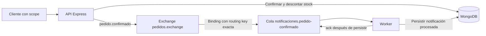

# Clase 04 — Cuando REST request-response no alcanza

Integración de Aplicaciones en Entorno Web · UTN FRC · 2026

Este apunte desarrolla el contenido de la [presentación del día](../presentacion/index.html). La [actividad individual](../actividad-practica.md) utiliza el mismo contrato. El objetivo es confirmar un pedido con la seguridad de Clase 03 y procesar después una notificación mediante RabbitMQ y un worker. Las demostraciones de Webhook, WebSocket y gRPC sirven para comparar alternativas; no son implementaciones obligatorias del taller.

## 1. El problema del e-commerce

La API ya permite crear productos, crear pedidos y confirmar una compra. Confirmar requiere validar el pedido, verificar disponibilidad, descontar stock y persistir el estado. Esas operaciones forman parte de la respuesta de negocio que el cliente necesita conocer.

Ahora queremos notificar la confirmación. Si la API espera a que un servicio de correo complete su trabajo, una demora de ese servicio alarga la respuesta. Si el correo falla después de descontar stock, el cliente recibe un error aunque parte de la compra ya sucedió. Agregar más llamadas dentro del mismo handler multiplica las dependencias que deben estar disponibles simultáneamente.

En nuestro ejercicio, el cliente necesita saber que su pedido quedó confirmado, pero no necesita esperar la notificación. Separamos ambos resultados:

| Resultado | Responsable | Momento observable |
|---|---|---|
| Confirmación del pedido | API y MongoDB | Durante `POST /pedidos/:id/confirmar`. |
| Publicación de `pedido.confirmado` | API y RabbitMQ | Antes de responder éxito a esa petición. |
| Procesamiento de la notificación | Worker y MongoDB | Después de consumir el mensaje. |

La respuesta HTTP sigue siendo parte de la integración. Lo que trasladamos a otro proceso es el efecto posterior. Esta elección agrega infraestructura y nuevos estados de fallo; se justifica porque podemos tolerar que la notificación ocurra más tarde.

## 2. Elegir la interacción según la necesidad

Las siguientes decisiones corresponden al caso didáctico. Una arquitectura puede combinar varias de ellas.

| Alternativa | Interacción | Uso en el e-commerce | Pregunta para decidir |
|---|---|---|---|
| REST sobre HTTP | El cliente solicita una operación y recibe una respuesta. | Consultar productos o confirmar un pedido. | ¿Necesito conocer el resultado ahora? |
| Mensajería con cola | El productor publica; un consumidor procesa mediante un broker. | Procesar la notificación aunque el worker esté detenido temporalmente. | ¿Puedo separar en el tiempo la producción y el procesamiento? |
| Webhook | Un sistema inicia una petición HTTP al receptor cuando ocurre un hecho. | Un proveedor informa un cambio en una entrega. | ¿El receptor ofrece una URL para recibir avisos? |
| WebSocket | Los extremos intercambian mensajes en una conexión persistente. | Actualizar una pantalla de seguimiento. | ¿Necesito comunicación continua con un cliente conectado? |
| gRPC | Un cliente invoca operaciones definidas por un contrato de servicio. | Consultar estado entre servicios internos. | ¿Me conviene un contrato tipado y herramientas de generación? |

Un Webhook evita consultar periódicamente al emisor, pero cada entrega continúa siendo una petición HTTP. El receptor debe estar accesible en ese momento o el emisor debe disponer de una política propia de reintentos. El término no garantiza una cola. Véase la descripción oficial de [Webhooks de GitHub](https://docs.github.com/en/webhooks/about-webhooks).

WebSocket permite intercambio bidireccional sin abrir una petición HTTP nueva por cada mensaje. Una conexión activa no equivale a almacenamiento durable ni recupera por sí sola los mensajes de un cliente desconectado. Véase [WebSocket API, MDN](https://developer.mozilla.org/en-US/docs/Web/API/WebSockets_API).

gRPC admite llamadas unarias y distintas formas de streaming. Por lo tanto, gRPC también puede ser request-response; cambiar de protocolo no elimina automáticamente la dependencia temporal entre cliente y servidor. Véase [conceptos básicos de gRPC](https://grpc.io/docs/what-is-grpc/core-concepts/).

## 3. Continuidad con la Clase 03

La rama `clase-04-inicio` debe contener la actividad anterior resuelta. Al comenzar esta clase, el proyecto conserva Express, Mongoose, CommonJS y las credenciales configuradas mediante `.env`.

| Ruta | Protección y resultado previsto |
|---|---|
| `GET /health` | Pública; `200`. No demuestra por sí sola que el broker esté listo. |
| `GET /productos` | Pública; `200`. |
| `POST /productos` | `x-api-key`; `201` con clave válida o `401` sin ella. |
| `GET /pedidos` | JWT con `read:pedidos`; `200`. |
| `POST /pedidos` | JWT con `write:pedidos`; `201`. |
| `POST /pedidos/:id/confirmar` | JWT con `confirm:pedidos`; `200` al confirmar y publicar. |
| `GET /token-info` | JWT válido; diagnóstico del token de Clase 03. |

El token sigue siendo un access token real de Auth0, obtenido mediante `client_credentials`, para el audience `https://iaew-pedidos-api`. La autenticación verifica el JWT y la autorización exige el scope de la operación. Sin token válido se espera `401`; con token válido pero sin el scope requerido, `403`. La biblioteca utilizada separa ambas responsabilidades mediante `auth` y `requiredScopes`. Véase [protección de una API Express con Auth0](https://auth0.com/docs/quickstart/backend/nodejs).

La publicación debe ocurrir después de pasar esos controles y las validaciones de negocio. Un intento rechazado no representa un pedido confirmado y, por lo tanto, no debe producir `pedido.confirmado`. Tampoco se reemplaza la API key de productos por otro mecanismo durante este taller.

## 4. Productor, exchange, cola y consumidor



El productor es la API. RabbitMQ es el broker que recibe y enruta mensajes. El exchange `pedidos.exchange` es de tipo `direct`: compara la routing key con la clave del binding. La cola `notificaciones.pedido-confirmado` queda vinculada mediante `pedido.confirmado`. El worker consume esa cola. Esta separación permite que una publicación encuentre la cola aunque todavía no haya un consumidor ejecutándose. Véase [exchanges y bindings de RabbitMQ](https://www.rabbitmq.com/docs/exchanges).

En el taller, **el productor declara exchange, cola y binding antes de publicar**. Si dejáramos la declaración exclusivamente al worker, la primera demostración podría fallar: el worker aún no se ejecutó y no existe la cola que esperamos observar. Declarar la misma topología desde ambos procesos exige conservar los mismos nombres y propiedades.

El exchange no es el lugar donde observamos mensajes pendientes de consumo. Buscamos la cola. Si un equipo inicia varios workers sobre esa misma cola, sus consumidores compiten por las entregas; no se trata de enviar automáticamente una copia a cada proceso. Para efectos independientes, como facturación y notificación, se discutirían colas distintas, fuera del alcance obligatorio de hoy.

## 5. Un evento expresa un hecho

`pedido.confirmado` dice que una acción de negocio ya ocurrió. No es una orden para que el worker confirme el pedido. Por esa razón, el consumidor no vuelve a descontar stock ni cambia nuevamente el estado de negocio.

El contrato JSON es:

```json
{
  "eventId": "db5c3f8f-f951-4dce-9f33-946688448f74",
  "type": "pedido.confirmado",
  "version": 1,
  "occurredAt": "2026-09-07T21:15:00.000Z",
  "data": {
    "pedidoId": "64b7f1e5c0a1e2f345678901"
  }
}
```

| Campo | Significado en esta clase |
|---|---|
| `eventId` | UUID que permite identificar la publicación en las evidencias. |
| `type` | Hecho de negocio reconocido por el consumidor. |
| `version` | Versión del formato que sabe interpretar el worker. |
| `occurredAt` | Fecha del evento en formato ISO 8601. No es la fecha de consumo. |
| `data.pedidoId` | Referencia al pedido que el worker consultará o actualizará. |

El contrato es compartido entre productor y consumidor: no alcanza con que sea JSON válido. El consumidor debe reconocer tipo, versión y estructura. El `eventId` no deduplica automáticamente; es un identificador, no una garantía. No incluimos el Bearer token, la API key ni datos personales innecesarios. El worker usa su propia configuración de conexión, no reutiliza la identidad del cliente HTTP.

Un evento pequeño obliga al consumidor a consultar el estado que necesita. Un evento con más datos podría evitar esa consulta, pero introduciría decisiones de exposición y compatibilidad. Para el objetivo de hoy basta `pedidoId`.

## 6. Dos estados diferentes en MongoDB

El pedido conserva `estado`, con valores `pendiente`, `confirmado` y `cancelado`. Agregamos `notificacionEstado`, con valores `pendiente` o `procesada`, y `notificadoEn`.

| Momento | `estado` | `notificacionEstado` | `notificadoEn` |
|---|---|---|---|
| Pedido creado | `pendiente` | `pendiente` | Sin fecha de procesamiento. |
| Confirmado, worker detenido | `confirmado` | `pendiente` | Sin fecha de procesamiento. |
| Worker completó la actualización | `confirmado` | `procesada` | Fecha de procesamiento. |

La primera fila no significa que deba enviarse una notificación antes de confirmar. El worker solo procesa el evento de confirmación de un pedido confirmado. El campo representa el estado del efecto posterior dentro de este modelo didáctico.

El laboratorio **simula la notificación** mediante una escritura en MongoDB. `procesada` no demuestra que una persona recibió un correo. La evidencia válida es el cambio persistido, acompañado por la identificación del pedido y del evento.

Separar estados evita afirmar que el pedido volvió a estar pendiente porque falló una notificación. También permite que la interfaz comunique con precisión qué terminó y qué sigue pendiente.

## 7. Publicación y procesamiento: dos confirmaciones distintas

El recorrido del productor es:

1. Autenticar, autorizar y validar el pedido.
2. Verificar stock y ejecutar la confirmación heredada.
3. Guardar el pedido confirmado, con notificación pendiente.
4. Construir y publicar el evento.
5. Esperar la confirmación del broker antes de responder `200`.

Un **publisher confirm** informa al productor sobre la aceptación del mensaje por el broker. Un **consumer ack** informa al broker que el consumidor terminó el procesamiento de una entrega. Son mecanismos independientes; el primero no informa que la notificación ya se procesó. Usar ack manual permite posponer el reconocimiento hasta después de persistir. Véase [confirmaciones y acknowledgements de RabbitMQ](https://www.rabbitmq.com/docs/confirms).

Con `amqplib`, el canal de publicación se crea como canal de confirmaciones. `publish()` devuelve un booleano relacionado con el búfer de escritura; `await channel.publish(...)` no espera la aceptación del broker. Para eso se utiliza el callback de confirmación o `waitForConfirms()` en el canal correspondiente. Véase la [referencia de la API de amqplib](https://amqp-node.github.io/amqplib/channel_api.html).

El fragmento siguiente muestra solamente el mecanismo de confirmación; la implementación completa debe además declarar la topología y manejar conexión, errores y cierre:

```js
const channel = await connection.createConfirmChannel();
channel.publish(
  'pedidos.exchange',
  'pedido.confirmado',
  Buffer.from(JSON.stringify(evento)),
  { contentType: 'application/json', persistent: true }
);
await channel.waitForConfirms();
```

Que un mensaje sea persistente y una cola durable mejora su comportamiento ante reinicios, pero no vuelve infalible al sistema ni crea una transacción con MongoDB. Una pérdida de conexión puede dejar al productor sin saber si una publicación fue aceptada. La recuperación puede producir duplicados; la confiabilidad involucra a productores, broker y consumidores. Véase la [guía de confiabilidad de RabbitMQ](https://www.rabbitmq.com/docs/reliability).

## 8. El ciclo de trabajo del consumidor

El worker abre sus conexiones, declara la topología y consume con reconocimiento manual. Para cada entrega:

1. Convierte el contenido a texto y parsea JSON.
2. Valida los campos del contrato, incluido `pedidoId`.
3. Comprueba que exista un pedido confirmado.
4. Actualiza `notificacionEstado` y `notificadoEn` si todavía no se procesó.
5. Ejecuta `ack` después de completar la persistencia.

Si llega nuevamente un evento de un pedido ya procesado, se conserva el resultado y se reconoce la entrega. No se vuelve a descontar stock ni se simula un envío externo adicional. Esta tolerancia localizada no implica que todas las operaciones de la API sean idempotentes o seguras ante cualquier concurrencia.

Si se reconociera antes de guardar y el proceso se detuviera entre ambas acciones, la cola podría considerar completada una entrega que todavía no produjo su resultado. Si se guarda y se pierde la conexión antes del ack, puede haber una nueva entrega. Por eso el orden y el tratamiento de repetidos deben pensarse juntos.

En este laboratorio los mensajes inválidos y los fallos de procesamiento se registran y se rechazan sin reencolarlos indefinidamente. Sin una DLQ configurada, ese rechazo puede descartar el mensaje. Los logs permiten detectar el problema, pero no constituyen una recuperación automática. La Clase 05 desarrollará reintentos, tratamiento de fallas y DLQ; no hay que implementar esas políticas hoy.

## 9. Entorno local y Compose mínimo

La API y el worker se ejecutan con Node.js en terminales diferentes. MongoDB sigue en el contenedor `iaew-mongo`. Compose administra solamente RabbitMQ, por lo que no crea otro MongoDB sobre el mismo puerto. Para que el laboratorio sea reproducible en Docker Desktop, el Compose provisto monta `/var/lib/rabbitmq` como `tmpfs`; sus mensajes se pierden si se recrea el contenedor. Es una decisión didáctica para un entorno efímero, no una configuración de producción.

| Configuración | Uso |
|---|---|
| `PORT=3000` | API HTTP local. |
| `MONGODB_URI=mongodb://127.0.0.1:27017/iaew_ecommerce` | Base compartida por API y worker. |
| `AUTH0_DOMAIN` | Dominio del tenant configurado en Clase 03. |
| `AUTH0_AUDIENCE=https://iaew-pedidos-api` | Identificador de la API protegida. |
| `INTERNAL_API_KEY` | Clave local para crear productos. |
| `RABBIT_URL` | URI AMQP usada por los procesos Node.js. |
| `RABBIT_USER`, `RABBIT_PASS` | Usuario y contraseña locales configurados en Compose. |

La URI AMQP debe corresponder a las credenciales configuradas para RabbitMQ. El puerto `5672` recibe conexiones AMQP y `15672` sirve la consola de administración. En este laboratorio se accede desde la máquina local; la consola no sustituye la conexión AMQP.

Una vez incorporados los archivos y dependencias que indica la actividad, la secuencia de ejecución es:

```bash
npm ci
docker start iaew-mongo
docker compose up -d rabbitmq
docker compose ps
docker compose logs rabbitmq
npm run dev
```

En otra terminal, ubicada en el mismo proyecto, se inicia `npm run worker` cuando lo indique la prueba. Si `iaew-mongo` no existe, se sigue la alternativa de creación de la actividad; `docker start` solo inicia contenedores existentes. Ver un contenedor iniciado no garantiza que el servicio terminó de inicializarse: revisar logs y disponibilidad antes de publicar.

`docker compose up -d rabbitmq` crea o inicia el servicio y lo deja ejecutándose en segundo plano. Compose aplica la configuración declarada y mantiene los volúmenes montados cuando corresponde recrear un contenedor. Véase [docker compose up](https://docs.docker.com/reference/cli/docker/compose/up/).

Al cerrar, detener API y worker con `Ctrl+C` y usar `docker compose stop rabbitmq`; detener `iaew-mongo` solamente si ya no se lo necesita. No borrar volúmenes para resolver un problema de arranque. Los archivos `.env` y los tokens reales no forman parte de la entrega.

## 10. La prueba que demuestra el desacople

La observación central debe hacerse con **el worker detenido desde antes de confirmar**:

1. Crear un producto con stock mediante la API key y crear un pedido con `write:pedidos`.
2. Confirmarlo con un token que tenga `confirm:pedidos`.
3. Conservar la respuesta `200` y consultar pedidos con `read:pedidos`: el pedido está confirmado y la notificación sigue pendiente.
4. Abrir la cola `notificaciones.pedido-confirmado` en la consola de RabbitMQ y registrar el mensaje pendiente. No purgarlo ni retirarlo para tomar la evidencia; si se inspecciona el payload, usar la opción de reencolar.
5. Iniciar el worker y observar el procesamiento.
6. Consultar otra vez `GET /pedidos` y comprobar `notificacionEstado=procesada` y la fecha `notificadoEn`.

Una cola vacía no demuestra por sí sola que se procesó correctamente: el mensaje pudo rechazarse o no haberse publicado. Hay que correlacionar respuesta HTTP, mensaje, log y estado persistido usando los identificadores.

Después se comprueban los rechazos: `401`, `403`, repetición de confirmación (`409`) y stock insuficiente (`409`). Ninguno debe agregar un evento. Para evitar conclusiones equivocadas, observar la variación de la cola sobre un escenario controlado y pedidos identificados, no asumir que todo mensaje presente proviene de la última solicitud.

## 11. La ventana entre MongoDB y RabbitMQ

El orden «guardar, publicar» deja una ventana de fallo:

```text
MongoDB guarda confirmado → falla publicación → el pedido queda confirmado
                                              y la notificación pendiente
```

La API responde `503` explicando esa posibilidad. No promete rollback ni reintento automático. El cliente consulta el pedido antes de decidir cómo continuar. Repetir ciegamente la confirmación puede dar `409`, porque el pedido ya está confirmado. Tampoco debe restituirse stock de forma improvisada desde el worker.

Una respuesta `200` significa que se completó la confirmación y se obtuvo confirmación de publicación; no significa que terminó la notificación. No usamos `202` únicamente porque aparece una cola: en nuestro contrato la confirmación de negocio se ejecuta dentro de la petición.

El patrón **outbox**, presentado solo como concepto, busca registrar el cambio de negocio y la intención de publicar dentro de una misma frontera de escritura atómica. Un publicador posterior entrega los eventos pendientes. Para aplicarlo habría que diseñar esa atomicidad y la recuperación; agregar una colección llamada `outbox` sin esas propiedades no alcanza. Tampoco evita por sí solo duplicados en los consumidores.

La confirmación heredada tiene varias escrituras sobre pedidos y stock. El taller no la presenta como una transacción global robusta ante concurrencia. Reconocer este límite es parte de O4; resolverlo no es una ampliación obligatoria de la Clase 04.

## 12. Demostraciones y vínculo con el TPI

La demostración docente de Webhook muestra una petición HTTP saliente con datos sintéticos y la respuesta del receptor. La de WebSocket muestra un mensaje de cambio de estado en una conexión abierta. La lectura del `.proto` de gRPC permite identificar servicio, operación, pedido de entrada y respuesta. Ninguna de las tres reemplaza la práctica del productor y worker.

Para el TPI grupal, cada estudiante propone una interacción y la justifica: quién inicia, quién recibe, si necesita respuesta inmediata y qué ocurre si el receptor está detenido. No es necesario incorporar todas las tecnologías. Por ejemplo, una consulta de catálogo puede seguir usando REST; una notificación diferida puede justificar una cola; una pantalla conectada puede necesitar WebSocket.

**¿Qué pasaría si esta acción la ejecuta un agente de IA?** El agente seguiría necesitando un token válido con `confirm:pedidos`, recibiría `200`, `401`, `403`, `409` o `503` según el mismo contrato y debería distinguir «confirmado» de «notificación procesada». En particular, un `503` después de persistir no autoriza a repetir indiscriminadamente una acción de negocio. La integración debe ofrecer estados comprensibles y evidencia que el agente y una persona puedan interpretar.

## 13. Comprobación de comprensión y entrega

Antes de cerrar, poder explicar:

- Por qué la API puede responder mientras el worker está detenido.
- Qué diferencia hay entre exchange y cola, y por qué se declara el binding antes de publicar.
- Qué prueban el publisher confirm y el consumer ack.
- Por qué el worker no confirma el pedido ni descuenta stock.
- Qué queda persistido si falla la publicación después de guardar.
- Qué integración elegir para una interacción concreta del TPI y qué limitación tiene.

La entrega individual es un `.zip` con código, archivos de dependencias, `.env.example`, `compose.yaml` y `evidencias/pruebas-http.md`. Las evidencias contienen el payload, la cola con worker detenido, el procesamiento, la consulta final, los rechazos y la elección justificada. Excluir `.env`, tokens, credenciales reales y `node_modules`. La [actividad](../actividad-practica.md) detalla los pasos A1–A7 y su correspondencia con D01–D20; este apunte no agrega implementaciones obligatorias.
