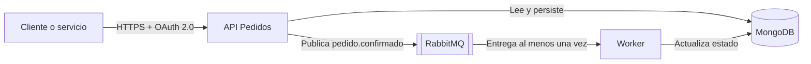

# Clase 06 — Documentación viva de integraciones

## 1. El problema: un sistema puede funcionar y seguir siendo imposible de integrar

La Clase 05 dejó una confirmación idempotente, reintentos limitados, DLQ y deduplicación. La evidencia muestra comportamiento correcto. Sin embargo, un consumidor nuevo no debería leer rutas, middleware, modelos y registros para descubrir el contrato.

La documentación de integración responde preguntas operativas:

- ¿qué operación existe y qué intención representa?;
- ¿qué datos, permisos y encabezados HTTP exige?;
- ¿qué respuestas y errores forman parte del contrato?;
- ¿qué componentes participan?;
- ¿qué eventos circulan?;
- ¿por qué se tomaron decisiones que condicionan al consumidor?

Una captura o un texto aislado envejece rápido. La documentación viva se guarda cerca del código, puede revisarse, versionarse y, en parte, validarse automáticamente.

## 2. Artefactos y herramientas que responden preguntas distintas

| Artefacto | Pregunta que responde | Público principal |
|---|---|---|
| OpenAPI | ¿Cómo invoco la API? | Clientes, testers, herramientas y agentes |
| C4 | ¿Dónde está cada responsabilidad? | Equipos técnicos y responsables de arquitectura |
| ADR | ¿Por qué se tomó esta decisión? | Equipo actual y futuro |
| Contrato de evento | ¿Qué publica el productor y qué puede asumir el consumidor? | Productores, consumidores y plataforma |
| EventCatalog | ¿Cómo se conectan productores, mensajes y consumidores? | Desarrollo y arquitectura |
| Backstage | ¿Qué software y APIs existen y quién los mantiene? | Organización técnica |

Ningún artefacto reemplaza a los demás. Swagger UI no explica por qué existe `Idempotency-Key`; un ADR no enumera todos los códigos HTTP; un C4 no define el esquema exacto del evento.

En la práctica obligatoria se construyen OpenAPI, Swagger UI, JSON Schema y EventCatalog. Se proporcionan plantillas de C4 y ADR para el TPI; Backstage se presenta mediante una demostración docente.

## 3. OpenAPI: contrato legible por personas y herramientas

OpenAPI describe una API HTTP con un documento estructurado YAML o JSON. Incluye metadatos, servidores, rutas, operaciones, parámetros, cuerpos, respuestas, seguridad y esquemas reutilizables.

En esta clase usamos OpenAPI 3.1.0. La estructura mínima es:

```json
{
  "openapi": "3.1.0",
  "info": { "title": "IAEW Pedidos API", "version": "1.0.0" },
  "paths": {}
}
```

El contrato debe describir comportamiento real. Si el código exige `confirm:pedidos` y el archivo declara `write:pedidos`, la documentación es un defecto, aunque el JSON sea válido.

### Rutas de Express y rutas de OpenAPI

Express representa parámetros con dos puntos:

```text
/pedidos/:id/confirmar
```

OpenAPI usa llaves y exige declarar el parámetro:

```text
/pedidos/{id}/confirmar
```

Confundir ambas formas produce un contrato que no representa correctamente la ruta.

### Operación y respuestas

Una operación debe expresar intención, no repetir el nombre técnico del método. “Confirmar un pedido una sola vez” informa más que “POST pedido”. También debe declarar respuestas relevantes, incluidas las que el cliente necesita manejar.

Para la confirmación:

- `200`: primera confirmación o repetición que recupera el resultado anterior (*replay*);
- `400`: cuerpo o clave inválida;
- `401`: token ausente o inválido;
- `403`: falta `confirm:pedidos`;
- `404`: pedido inexistente;
- `409`: estado, stock o clave incompatible;
- `503`: publicación del evento no disponible.

Documentar solo `200` oculta el trabajo que un consumidor debe realizar.

## 4. Seguridad en OpenAPI

La API usa OAuth 2.0 con flujo `client_credentials` para integración servicio a servicio. El contrato declara el esquema y luego lo aplica a la operación.

```json
"security": [{ "oauth2": ["confirm:pedidos"] }]
```

El audience vigente es `https://iaew-pedidos-api`. OpenAPI no define un campo estándar para audience; el laboratorio lo registra como extensión `x-audience`. El `tokenUrl` usa `TU_AUTH0_DOMAIN`: no se versionan secretos ni identificadores privados.

`x-api-key` se usa en operaciones internas de productos. No debe mezclarse con OAuth ni documentarse como reemplazo del Bearer token en la confirmación.

## 5. Swagger UI: una vista del contrato

Swagger UI renderiza OpenAPI y permite explorar operaciones. Puede habilitar pruebas desde el navegador, pero no transforma un contrato incorrecto en uno correcto.

En Express:

```js
const openapi = require('../docs/openapi.json');

app.get('/api-docs/openapi.json', (req, res) => res.json(openapi));
app.get('/api-docs/', (req, res) => res.type('html').send(
  '<div id="swagger-ui"></div>...'
));
```

La actividad carga Swagger UI 5 desde CDN y conserva el contrato en la API local. Conviene publicar también el JSON: otras herramientas pueden consumirlo sin extraerlo de la interfaz. Si no hay Internet, el JSON sigue disponible aunque la interfaz no cargue sus recursos.

Un `200` en `/api-docs/` demuestra que la vista carga. No demuestra que cada operación coincide con el código ni que Auth0 funciona.

## 6. Contract-first y code-first

En contract-first, el equipo acuerda OpenAPI antes de implementar. Facilita mocks, trabajo paralelo y revisión temprana. En code-first, genera o mantiene el contrato desde código y annotations. Reduce duplicación, pero puede convertir detalles de implementación en contrato accidental.

El laboratorio adopta un enfoque explícito: escribir un contrato pequeño a partir de código ya existente y compararlo con pruebas. El objetivo es aprender el contenido, no automatizarlo todavía.

## 7. C4 Model: escribir arquitectura con niveles de zoom

C4 Model no es solamente una forma de dibujar cajas. Es un vocabulario para escribir y comunicar una arquitectura mediante elementos, responsabilidades y relaciones. Una relación útil puede leerse como una oración: **origen se comunica con destino para lograr un propósito mediante una tecnología o protocolo**.

C4 organiza esa descripción en vistas:

1. **Context:** personas y sistemas externos.
2. **Container:** aplicaciones, procesos y almacenes principales.
3. **Component:** piezas relevantes dentro de un contenedor.
4. **Code:** detalle de implementación, usado solo cuando aporta valor.

“Container” en C4 no significa necesariamente contenedor Docker. Una API Node.js, una base de datos y un worker son contenedores arquitectónicos porque ejecutan o almacenan responsabilidades separadas.

El nivel elegido controla qué se puede escribir. Context presenta el sistema como una caja y muestra sus actores y dependencias externas. Container abre esa caja y muestra aplicaciones y almacenes. Component abre un solo contenedor y muestra sus responsabilidades internas. Mezclar esos niveles produce diagramas difíciles de leer y revisar.

Para mantener la arquitectura alineada con el repositorio:

- usar los mismos nombres que aparecen en el código, OpenAPI, eventos y README;
- dar a cada elemento una responsabilidad concreta;
- rotular cada relación con propósito y, cuando aporte valor, protocolo;
- guardar los documentos con nombres sin espacios, por ejemplo `c4-context.md`;
- revisar el modelo cuando cambia la solución.

La clase analiza una plantilla de la vista Container:



El diagrama debe mostrar responsables, tecnologías cuando importan y relaciones con propósito. Un inventario de cajas sin flechas explicadas aporta poco.

## 8. ADR: conservar el razonamiento

Un Architecture Decision Record registra una decisión significativa en un momento concreto. Su estructura mínima:

- título;
- estado;
- contexto;
- decisión;
- consecuencias;
- alternativas cuando ayudan a entender el descarte.

Un ADR no busca describir toda la arquitectura ni funcionar como tutorial. Debe permitir que alguien comprenda por qué el sistema exige `Idempotency-Key` y qué costo acepta.

Los ADR no se borran cuando cambia una decisión. Se marcan como reemplazados por otro ADR para conservar la historia.

## 9. Contrato de evento

Un evento de integración es una afirmación sobre algo que ya ocurrió. `pedido.confirmado` debe tener identidad, tipo, versión, tiempo y datos mínimos:

```json
{
  "eventId": "3f5204d4-8952-4a3f-92ea-0a6222151299",
  "type": "pedido.confirmado",
  "version": 1,
  "occurredAt": "2026-09-28T21:00:00.000Z",
  "data": { "pedidoId": "507f1f77bcf86cd799439011" }
}
```

JSON Schema formaliza campos, tipos y restricciones. También es necesario documentar semántica:

- productor: API Pedidos;
- consumidor actual: worker de notificaciones;
- clave de enrutamiento (*routing key*): `pedido.confirmado`;
- entrega: al menos una vez (*at least once*);
- deduplicación: `eventId`;
- compatibilidad: cambios aditivos antes de romper consumidores.

En la Entrega 1 del TPI deben prepararse las vistas Context, Container y Component. La plantilla de esta clase incluye un ejemplo inicial de cada nivel para el caso de pedidos; cada grupo debe adaptarlos a su dominio y a su implementación real.

## 10. EventCatalog: navegar productores, consumidores y contratos

EventCatalog convierte recursos guardados en Git en un catálogo navegable. El caso usa tres recursos y un archivo de esquema:

- `PedidosAPI`, que declara `sends: PedidoConfirmado`;
- `PedidoConfirmado`, versión `1.0.0`, asociado al JSON Schema;
- `WorkerNotificaciones`, que declara `receives: PedidoConfirmado`.

La identidad y la versión deben coincidir. EventCatalog puede entonces mostrar relaciones e impacto sin leer código. Los archivos MDX siguen siendo revisables mediante pull requests. La documentación oficial actual también permite organizar servicios y mensajes dentro de sistemas y generar contenido desde AsyncAPI.

EventCatalog complementa OpenAPI. OpenAPI describe HTTP; EventCatalog conecta servicios, mensajes, propietarios y dependencias.

## 11. Backstage: catálogo general de software

Backstage Software Catalog centraliza metadatos de componentes, APIs, propietarios y relaciones. La fuente suele ser un archivo `catalog-info.yaml` versionado junto al código.

El laboratorio declara dos entidades:

```yaml
kind: Component
metadata:
  name: iaew-pedidos-api
spec:
  type: service
  owner: user:default/guest
  providesApis: [pedidos-api]
---
kind: API
metadata:
  name: pedidos-api
spec:
  type: openapi
  definition:
    $text: ../../docs/openapi.json
```

`Component` representa la unidad de software. `API` registra el contrato que provee. `$text` evita copiar OpenAPI dentro del descriptor: Backstage resuelve la ruta desde `recursos/backstage/catalog-info.yaml`. Si el descriptor estuviera en la raíz, la ruta sería `./docs/openapi.json`.

En una instancia preparada, el flujo manual es **Create → REGISTER EXISTING COMPONENT → ANALYZE → IMPORT**. La URL debe ser pública y apuntar al descriptor en el repositorio. Sin instancia o URL accesible, solo puede verificarse la estructura; no corresponde afirmar que el componente quedó registrado.

### EventCatalog y Backstage no son duplicados

| Herramienta | Foco de esta clase |
|---|---|
| EventCatalog | Flujo dirigido por eventos: productor, mensaje, schema y consumidor. |
| Backstage | Inventario general: componente, API, propiedad, ciclo de vida y descubrimiento. |

Una organización puede enlazar ambos portales o elegir uno según escala y necesidades. La práctica muestra sus modelos, no prescribe adoptar ambos en producción.

## 12. Documentar errores e idempotencia

Los errores también son contrato. El formato del proyecto contiene:

```json
{
  "error": "Descripción legible",
  "code": "IDEMPOTENCY_KEY_INVALID",
  "retryable": false,
  "action": "Enviar una clave válida y estable por operación"
}
```

`error` ayuda a una persona. `code` permite decisión automática. `retryable` evita repeticiones inútiles. `action` orienta recuperación. Los contratos no deben exponer stack traces, tokens ni información interna sensible.

El encabezado de respuesta `Idempotency-Replayed` también forma parte del contrato. Permite distinguir una primera ejecución del resultado recuperado.

## 13. IA como borrador, no como fuente de verdad

Una IA puede redactar una descripción, proponer esquemas o transformar código. También puede inventar:

- códigos de estado;
- nombres de endpoints;
- scopes;
- campos de eventos;
- garantías como exactly once;
- dependencias inexistentes.

Protocolo mínimo de revisión:

1. limitar el pedido a un artefacto concreto;
2. no incluir secretos ni datos personales;
3. comparar cada literal con código y configuración;
4. validar sintaxis con una herramienta;
5. ejecutar una prueba representativa;
6. registrar correcciones humanas.

Si un agente de IA consume la API, el contrato es parte de su superficie de control. Un valor `retryable` incorrecto o un encabezado omitido puede producir efectos de negocio duplicados.

## 14. Versionado y compatibilidad

Versionar un documento no alcanza: hay que conservar compatibilidad o comunicar la ruptura. En eventos, agregar un campo opcional suele ser compatible; renombrar `pedidoId` no lo es. En HTTP, quitar una respuesta o cambiar un campo requerido afecta consumidores.

La versión `1` de `pedido.confirmado` identifica su esquema. Una versión nueva necesita estrategia de convivencia, migración o consumidores coordinados.

## 15. Errores frecuentes

- Documentar la intención deseada en lugar del comportamiento real.
- Declarar solo caminos exitosos.
- Confundir `:id` de Express con `{id}` de OpenAPI.
- Mezclar `x-api-key` con OAuth 2.0.
- Dibujar funciones y clases en una vista C4 Container.
- Usar un ADR como minuta o tutorial.
- Declarar exactamente una vez cuando RabbitMQ entrega al menos una vez.
- Aceptar un borrador de IA sin rastrear cada literal.
- Declarar productor y consumidor con IDs o versiones diferentes en EventCatalog.
- Registrar en Backstage una copia de OpenAPI que luego diverge del archivo real.

## 16. Relación con el TPI

La Entrega 1 pide C4, ADR y OpenAPI. La clase entrega herramientas para producirlos con criterio. No agrega documentos a la consigna ni cambia el alcance. La nueva fecha es 05/10/2026, sin defensa oral.

Un equipo puede usar la secuencia:

1. verificar comportamiento real;
2. dibujar límites y responsabilidades;
3. registrar decisiones significativas;
4. describir contratos HTTP y eventos;
5. revisar que documentación, código y pruebas coincidan.

## 17. Lista de comprobación de la práctica

- OpenAPI es `3.1.0` y parsea como JSON.
- La ruta usa `{id}`.
- `Idempotency-Key`, `confirm:pedidos` y audience coinciden con código.
- Las respuestas relevantes están declaradas.
- Swagger UI y el JSON publicado responden `200`.
- El evento mantiene `pedido.confirmado`, versión `1`, `eventId` y `pedidoId`.
- EventCatalog conecta productor, evento y consumidor con versión `1.0.0`.
- Ningún artefacto contiene secretos.

Para preparar el TPI, las plantillas permiten comprobar que el C4 muestre contenedores y relaciones y que el ADR registre contexto, decisión y consecuencias. En la demostración, Backstage relaciona Component y API mediante `providesApis`.

## Fuentes de consulta

- OpenAPI Initiative, especificación OpenAPI 3.1.
- Swagger, documentación de Swagger UI.
- Simon Brown, modelo C4.
- Michael Nygard, Architecture Decision Records.
- JSON Schema, Draft 2020-12.
- EventCatalog: <https://www.eventcatalog.dev/> y guía de EventCatalog v4.
- Backstage Software Catalog: <https://backstage.io/docs/features/software-catalog/>.
- Backstage Descriptor Format: <https://backstage.io/docs/features/software-catalog/descriptor-format/>.
