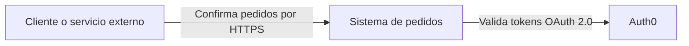
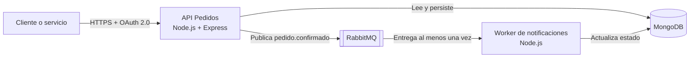
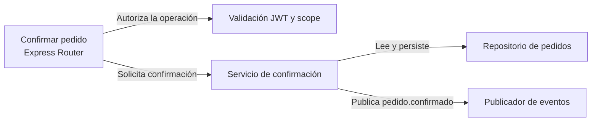

# Arquitectura con C4 Model

C4 permite escribir la arquitectura con un vocabulario consistente: personas, sistemas, contenedores, componentes y relaciones. Cada elemento debe tener nombre, responsabilidad y tecnología cuando corresponda. Cada relación debe indicar propósito o protocolo.

## Context

## Container

## Component

## Criterios de revisión

- El título declara el nivel y el alcance de la vista.
- Cada caja representa una responsabilidad del nivel elegido.
- Cada flecha explica una relación; no es una línea decorativa.
- Los nombres coinciden con el código, OpenAPI, eventos y README.
- Context no muestra detalles internos; Container no baja a funciones; Component se limita a un contenedor.

## Responsabilidades

- **Cliente o servicio:** envía token e `Idempotency-Key`.
- **API Pedidos:** valida permisos, confirma el pedido y publica el evento.
- **MongoDB:** persiste pedidos, identidad y eventos procesados.
- **RabbitMQ:** desacopla productor y consumidor, reintentos y DLQ.
- **Worker:** consume, deduplica por `eventId` y actualiza el estado.

El diagrama muestra contenedores y relaciones. No intenta describir clases ni líneas de código.
