# Clase 07 — Guion docente
Fecha: 05/10/2026. Presentación, notas docentes y práctico individual de 45 minutos.

## 1. Integración de Aplicaciones en Entorno Web

**Contenido visible:**

Observabilidad de servicios: del síntoma a la evidencia. TRAZAS · LOGS · MÉTRICAS · CORRELACIÓN

**Notas para explicar:**

- La portada presenta las tres señales y la correlación que las conecta. Hoy analizamos un mismo pedido desde distintas perspectivas.
- El resultado esperado es explicar un incidente con evidencia, no solamente mostrar un dashboard.
- Usaremos el caso de pedidos y Grafana. Primero entendemos el problema; después aplicamos el laboratorio preparado.

## 2. El contrato dice qué debería pasar

**Contenido visible:**

Cliente → API de pedidos → RabbitMQ → Worker Resultado anterior OpenAPI describe cómo confirmar; el schema describe  pedido.confirmado . Evidencia anterior Swagger UI, contrato del evento y relaciones entre productor y consumidor. La documentación explica lo esperado. Ahora necesitamos observar lo que ocurrió realmente.

**Notas para explicar:**

- El diagrama muestra el flujo conocido y las tarjetas recuperan los contratos trabajados en documentación. Si hay evidencia de la clase anterior, abrirla brevemente.
- Un contrato permite integrar equipos, pero no describe la ejecución de un pedido particular a las diez de la mañana.
- La confirmación HTTP y el procesamiento asíncrono ocurren en momentos distintos: un 200 no demuestra que el worker terminó.

## 3. «El pedido fue aceptado, pero no llegó a cocina»

**Contenido visible:**

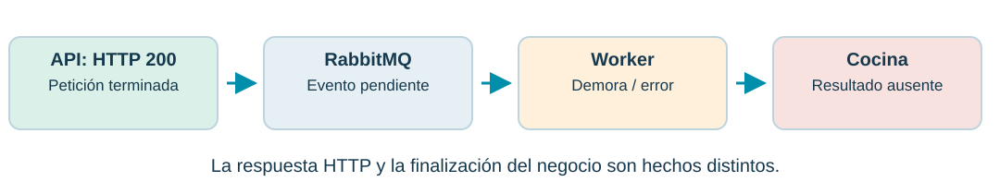

¿Dónde se interrumpió el recorrido? ¿Afecta a un pedido o a todos?

**Notas para explicar:**

- El diagrama muestra una API en verde que respondió, un evento en RabbitMQ, un worker con demora y un resultado de negocio ausente. El color identifica el estado observado, no una causa demostrada.
- El worker representa el consumidor del evento; cocina es el escenario de negocio que motiva la investigación. No damos por implementada una aplicación de cocina.
- La pregunta para el grupo es: ¿qué evidencia pedirían antes de reiniciar servicios? Esperamos tiempos, errores, identificación del pedido y estado de recursos.

## 4. Cada servicio ve una parte de la historia

**Contenido visible:**

Logs separados Mensajes intercalados entre réplicas y servicios. Tiempo y concurrencia Muchos pedidos similares ocurren a la vez. Límites asíncronos La petición termina antes que el consumo del evento. Un contenedor «running» y un endpoint «healthy» no prueban que el negocio funciona.

**Notas para explicar:**

- Las tarjetas muestran tres motivos por los que buscar un mensaje aislado no alcanza: dispersión, concurrencia y separación temporal.
- Una cola puede acumular trabajo aunque los procesos estén vivos. Un chequeo de salud solo demuestra lo que efectivamente comprueba.
- Necesitamos señales que permitan relacionar operaciones y estudiar tendencias. Eso motiva la observabilidad.

## 5. ¿Por qué observabilidad?

**Contenido visible:**

Observabilidad Capacidad de inferir el estado interno a partir de las señales que emite el sistema. Monitoreo Seguimiento de condiciones conocidas: disponibilidad, errores, tiempos y recursos. Monitoreamos: «hay una demora». Investigamos: «¿qué cambió y dónde se produce?»

**Notas para explicar:**

- Las dos tarjetas comparan conceptos complementarios. Observabilidad tiene su origen conceptual en teoría de control y se aplica aquí a sistemas de software.
- El monitoreo detecta situaciones previstas; la observabilidad ayuda a formular y responder nuevas preguntas usando telemetría suficiente.
- Tener una herramienta instalada no garantiza observabilidad: debemos emitir datos útiles, relacionarlos e interpretarlos.

## 6. Primero comprender; después aplicar

**Contenido visible:**

Bloque Tiempo Problema, continuidad y objetivo 10 min Repaso de Docker y Compose 15 min Señales, instrumentación y correlación 25 min Herramientas y lectura de incidentes 10 min Monitores y alertas 10 min Práctico individual con entorno preparado 45 min Síntesis y TPI 5 min 120 minutos. Descargar imágenes y configurar Auth0 antes de clase.

**Notas para explicar:**

- La tabla suma 120 minutos: setenta de explicación y diálogo, cuarenta y cinco de práctico individual y cinco de cierre.
- El práctico utiliza infraestructura e instrumentación preparadas: se concentra en comprobar, correlacionar y diagnosticar. El armado inicial y las imágenes se preparan antes.
- El repaso operativo inicial del práctico aplica los quince minutos de Docker; no constituye un segundo bloque teórico. Los ejemplos de las diapositivas siguen siendo ilustrativos.

## 7. Una imagen se ejecuta como contenedor

**Contenido visible:**

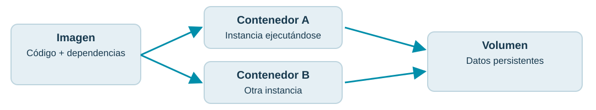

Puertos: conectividad · Variables: configuración · Volúmenes: persistencia.

**Notas para explicar:**

- A la izquierda hay una imagen; sus flechas producen dos contenedores a la derecha. Los contenedores se vinculan con un volumen: la ejecución y los datos tienen ciclos de vida diferentes. Cada servicio puede tener su propio volumen; el dibujo no obliga a compartirlo.
- Publicar un puerto permite entrar desde el host. Entre contenedores de una red compartida usamos el nombre del servicio y su puerto interno.
- docker stats ayuda a inspeccionar el presente, pero no sustituye un historial consultable de métricas.

## 8. Describir el sistema en un archivo

**Contenido visible:**

services:
  api:
    image: ejemplo/pedidos-api:version-fijada
    environment:
      RABBIT_URL: amqp://rabbitmq:5672
    ports:
      - "3000:3000"
  rabbitmq:
    image: rabbitmq:version-fijada Fragmento conceptual. El laboratorio incluye el Compose completo y ejecutable.

**Notas para explicar:**

- El fragmento visible declara dos servicios y una dirección basada en el nombre rabbitmq. Las imágenes son marcadores conceptuales, no versiones publicadas para ejecutar.
- Compose crea por defecto una red del proyecto donde los servicios se resuelven por nombre. localhost dentro de api apunta a api, no al broker.
- Un volumen se declara para datos persistentes y un healthcheck puede comprobar disponibilidad. depends_on por sí solo no garantiza que el servicio esté listo.

## 9. Arrancar, comprobar y detener

**Contenido visible:**

docker compose up -d --build --wait --wait-timeout 300
docker compose ps
docker compose logs --tail=50 api worker
docker compose down ¿Qué perdemos al mirar solamente logs separados?

**Notas para explicar:**

- El bloque muestra el ciclo básico de trabajo. api y worker son nombres propuestos para el entorno que prepararemos.
- up -d inicia en segundo plano; ps muestra el estado; logs reúne las salidas; down retira contenedores y redes. down sin -v conserva los volúmenes nombrados.
- Respuesta esperada: falta una relación explícita entre mensajes, servicios y operación, y falta historia de métricas. A continuación presentamos las señales.

## 10. Tres señales, tres preguntas

**Contenido visible:**

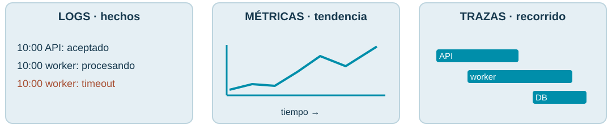

Hechos + tendencias + recorrido: tres perspectivas complementarias.

**Notas para explicar:**

- El gráfico presenta tres formatos: líneas de eventos, una curva temporal y barras de etapas. Los ejemplos son esquemáticos, sin valores medidos. Leer qué aporta cada formato antes de relacionarlos.
- Los logs contienen detalle; las métricas permiten ver agregados; las trazas reconstruyen el recorrido de una operación instrumentada.
- Un error puede aparecer en un log, aumentar un contador y marcar una etapa de una traza: son perspectivas relacionadas del mismo hecho.

## 11. Registrar hechos con contexto

**Contenido visible:**

{
  "timestamp": "2026-10-05T10:00:03Z",
  "level": "error", "service.name": "worker",
  "event": "pedido.procesamiento_fallido", "pedido_id": "P-42",
  "trace_id": "4bf92f3577b34da6a3ce929d0e0e4736",
  "span_id": "00f067aa0ba902b7", "error.type": "TimeoutError"
} Ejemplo ilustrativo. JSON permite filtrar campos sin interpretar frases libres.

**Notas para explicar:**

- El JSON registra un error del worker, con tiempo, servicio, evento, pedido e identificadores de traza y etapa. Leer primero esos campos.
- Un nivel error clasifica el registro, pero no establece automáticamente el estado de una traza ni envía una alerta. Esas acciones requieren configuración.
- No registrar tokens ni datos personales innecesarios. Un log útil relata un hecho y aporta contexto estable para buscarlo.

## 12. ¿Qué hace falta para tener logs útiles?

**Contenido visible:**

Logger estructurado → Contexto activo → Recolección / exportación → Loki → Grafana En la aplicación Definir eventos, niveles, timestamps y atributos; añadir contexto de traza al emitir el registro. En la plataforma Enviar por OTLP o recoger stdout; procesar, almacenar y configurar la búsqueda. Escribir en consola no garantiza que Loki reciba el registro.

**Notas para explicar:**

- El flujo parte del código y termina en una búsqueda. OTLP es el protocolo de OpenTelemetry para transportar telemetría.
- La aplicación necesita un logger y una integración que adjunte trace_id y span_id desde el contexto activo; escribir JSON sin esa integración no lo hace automáticamente.
- Podemos exportar logs por OTLP o recolectar stdout con un agente. El laboratorio envía logs por OTLP a Loki; stdout permite consultarlos con Compose y no se ingiere nuevamente en Loki.

## 13. Medir comportamientos y tendencias

**Contenido visible:**

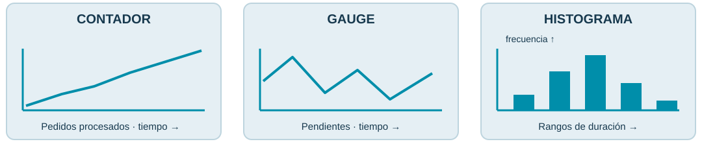

p95:  tiempo dentro del cual termina aproximadamente el 95 % de los intentos.  Ejemplo:  95 intentos duran 0,1 s y 5 duran 3 s. Promedio: 0,245 s; p95 por rango más próximo: 0,1 s. El 5 % más lento puede quedar fuera del p95.

**Notas para explicar:**

- Los gráficos distinguen contador, gauge e histograma: acumulación, valor actual y distribución. Un contador puede reiniciarse con el proceso.
- En cien intentos, noventa y cinco duran una décima de segundo y cinco duran tres segundos. La media es 0,245 segundos; con el criterio de rango más próximo, el percentil 95 es 0,1 segundos. Ni la media ni p95 describen por sí solos los cinco más lentos.
- p95 es el valor dentro del cual termina aproximadamente el 95 % de los intentos. En Prometheus lo estimamos con buckets del histograma: puede diferir del percentil calculado sobre datos individuales.
- Servicio y resultado permiten agrupar. Un pedido o trace_id diferente por etiqueta multiplicaría las series; los recursos se relacionan por servicio y tiempo.

## 14. Servicio y contenedor responden preguntas distintas

**Contenido visible:**

Aplicación / negocio Latencia, solicitudes por segundo, tasa de errores; confirmados, rechazados y duplicados. Contenedor / recursos CPU, memoria, red y límites. cAdvisor recoge métricas que Prometheus consulta. La API respondió 200: ¿demuestra que el worker terminó? ¿Una espera larga exige CPU alta?

**Notas para explicar:**

- Las dos tarjetas separan aplicación y recursos: latencia y resultados de negocio frente a CPU y memoria del contenedor.
- La API respondió 200: ¿demuestra que el worker terminó? No: la confirmación y el procesamiento asíncrono son etapas distintas. Buscamos el log de procesamiento y su estado persistido.
- ¿Una espera larga exige CPU alta? No: esperar una dependencia puede aumentar la duración con poca actividad de CPU. CPU alta es una pista que exige contraste, no una causa demostrada.

## 15. Instrumentar, recoger, conservar y consultar

**Contenido visible:**

SDK / exporter → OTLP o /metrics → Collector / Prometheus → Panel de Grafana Aplicación Contadores e histogramas en el código, atributos estables y unidades explícitas. Infraestructura cAdvisor, permisos adecuados, objetivo de scrape y etiquetas que identifiquen el servicio. Scrape: consultar periódicamente un endpoint de métricas. Las dos rutas de envío son alternativas configurables.

**Notas para explicar:**

- El flujo presenta el productor, transporte, almacenamiento y consulta. Un exporter adapta datos al formato del sistema que los recoge.
- Podemos exportar métricas de aplicación por OTLP al colector o exponer /metrics para que Prometheus las consulte. cAdvisor se recoge por scrape.
- El intervalo de recolección determina resolución; una subida muy breve puede no quedar representada. En Docker Desktop y WSL verificaremos acceso a recursos y etiquetas antes del práctico.

## 16. Una operación, varias etapas

**Contenido visible:**

API · confirmar 180 ms Publicar evento 30 ms Worker · procesar 2 800 ms Guardar resultado 120 ms Esquema ilustrativo, no a escala. Span = etapa con inicio, fin, atributos y relación causal. En este laboratorio: HTTP, publicar, consumir y dependencia simulada. Sin spans separados por consulta MongoDB ni por espera en cola.

**Notas para explicar:**

- Las barras representan etapas, no registros de texto ni utilización de CPU. Su posición indica cuándo ocurre cada etapa y su longitud su duración aproximada.
- Una traza reúne spans de una operación y conserva relaciones entre ellos. Un span puede terminar antes que un hijo asíncrono.
- No sumamos ciegamente duraciones: puede haber solapamientos. La espera de la cola requiere medición o instrumentación explícita; no aparece como un span mágico.

## 17. La traza necesita instrumentación y contexto

**Contenido visible:**

Instrumentar API → Propagar contexto → Instrumentar worker → Exportar a Tempo Automática Instrumentaciones disponibles para HTTP, DB y bibliotecas compatibles. Manual Spans de negocio y límites no cubiertos: publicar, consumir, reintentar y procesar. OpenTelemetry no descubre todo automáticamente: una etapa sin instrumentar puede quedar invisible.

**Notas para explicar:**

- Las cuatro cajas muestran instrumentación, propagación e instrumentación del consumidor antes de exportar la traza. El contexto une etapas; el exporter solo transporta lo que se registró.
- La instrumentación automática depende de bibliotecas compatibles y se inicializa antes de cargarlas. En este laboratorio usamos spans manuales para HTTP, publicación, consumo y dependencia simulada.
- Si no instrumentamos una consulta MongoDB o la espera en cola, no veremos una barra propia para ellas. La ausencia de span no demuestra ausencia de actividad o demora.
- El laboratorio conserva todas las trazas con poco tráfico. En producción el muestreo y la retención también condicionan qué podemos investigar.

## 18. Sin un vínculo, tres pantallas son tres historias

**Contenido visible:**

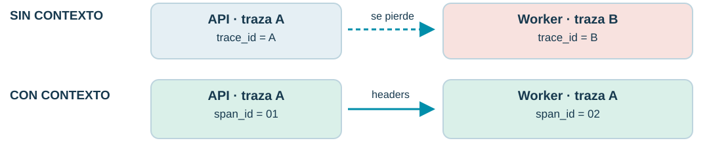

Logs ↔ traza: identificadores. Recursos ↔ operación: servicio y ventana temporal.

**Notas para explicar:**

- El gráfico compara dos filas. Arriba se pierde el contexto y aparecen trazas A y B; abajo se conserva el trace_id A y cada etapa mantiene un span_id propio. Las letras y números son abreviaturas didácticas.
- El vínculo exacto logs-traza usa trace_id y, cuando corresponde, span_id. El vínculo con recursos usa identidad del servicio o contenedor y tiempo.
- La correlación reduce el espacio de búsqueda, pero no prueba causalidad por sí sola. Necesitamos contrastar hipótesis y reproducir cuando sea posible.

## 19. Cuatro identificadores, cuatro responsabilidades

**Contenido visible:**

Identificador Para qué sirve pedido_id Identifica la entidad de negocio; puede participar en muchas operaciones. correlation_id Identificador elegido por la aplicación para relacionar un flujo; debe propagarse. trace_id / span_id Identifican la traza y una etapa concreta, respectivamente. Idempotency-Key Evita repetir el efecto de una operación según el contrato de la API. Un reintento puede conservar la clave idempotente y producir otra traza. No son identificadores intercambiables.

**Notas para explicar:**

- La tabla distingue identidad de negocio, correlación de aplicación, contexto de trazado e idempotencia. Mantener los nombres técnicos tal como se ven.
- Podemos usar trace_id para correlación operativa, pero correlation_id puede tener otro alcance. Hay que declarar esa decisión y conservarla al cruzar servicios.
- Una clave idempotente agrupa intentos de una operación según nuestro contrato; no determina el parent span ni constituye una traza.

## 20. El contexto debe cruzar RabbitMQ

**Contenido visible:**

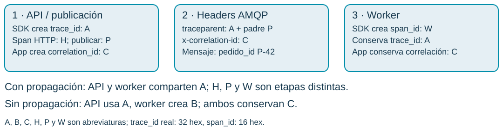

El SDK crea los IDs de traza y span. La aplicación crea y transporta la correlación; el logger registra el contexto activo.

**Notas para explicar:**

- Las tres cajas siguen el pedido P-42 desde API y publicación, a los headers AMQP y al worker. A identifica la traza; H, P y W son spans diferentes. C identifica la correlación de aplicación. Son abreviaturas, no valores válidos para copiar.
- El SDK inicia la traza y crea cada span. La API crea correlation_id; inyectamos traceparent y x-correlation-id en headers. El worker extrae el contexto y crea W como hijo de P, conservando A.
- Al desactivar la propagación, el worker inicia otra traza B. Conservamos deliberadamente C: podemos buscar sus logs, pero no reconstruir una traza continua por copiar ese identificador.
- traceparent transporta versión, trace_id, padre y flags; no transporta todos los logs. Este caso usa parent-child; lotes y otros patrones pueden requerir span links.

## 21. De una traza a sus logs y recursos

**Contenido visible:**

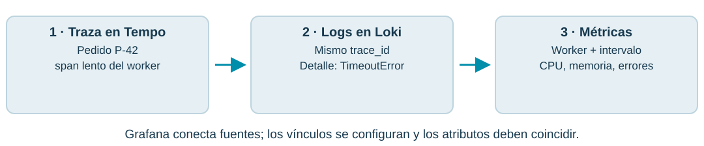

Los recursos son agregados: no representan el consumo exclusivo del pedido P-42.

**Notas para explicar:**

- Se ven tres pasos de investigación: seleccionar el span en Tempo, consultar su trace_id en Loki y comparar recursos del worker en ese intervalo. El tercer vínculo usa servicio y tiempo, no un trace_id como etiqueta de métricas.
- El enlace construye una consulta usando el contexto del span. Necesitamos mapear el servicio y filtrar el identificador; también ajustar la ventana temporal.
- trace_id se guarda como campo o metadato adecuado del log, no como etiqueta indexada de alta cardinalidad. El dashboard de recursos usa servicio/contenedor y tiempo, no un trace_id por serie.
- Los relojes deben estar razonablemente sincronizados. Las métricas de contenedores son agregadas y no representan el consumo exclusivo de ese pedido.

## 22. Cada herramienta resuelve una parte

**Contenido visible:**

Necesidad Herramienta Por qué Generar y transportar telemetría OpenTelemetry + Collector SDKs y protocolo común; recepción, procesamiento y envío. Consultar logs Loki Almacena logs y permite filtrarlos con LogQL. Reconstruir operaciones Tempo Almacena trazas y permite encontrarlas con TraceQL. Consultar series temporales Prometheus Recoge métricas y consulta agregados con PromQL. Recursos de contenedores cAdvisor Expone consumo y estadísticas de contenedores. Relacionar y visualizar Grafana Une fuentes en Explore, dashboards y alertas.

**Notas para explicar:**

- La tabla asigna una responsabilidad a cada componente. OpenTelemetry pertenece a CNCF y busca un estándar independiente del proveedor para instrumentar y transportar señales.
- Prometheus surgió para monitoreo mediante series temporales; Grafana aporta visualización; Loki y Tempo completan logs y trazas del ecosistema Grafana.
- Las consultas tienen lenguajes distintos porque los datos tienen modelos diferentes. No exigiremos dominar los tres lenguajes en esta introducción.

## 23. El objetivo no depende de una marca

**Contenido visible:**

Opción Cuándo elegirla Qué exige Grafana + Loki + Tempo + Prometheus Explorar las tres señales y sus relaciones. Instrumentación y configuración de las fuentes. SigNoz Una plataforma integrada centrada en OpenTelemetry. Backend e instrumentación; validar recursos del entorno. Elastic + Kibana Ecosistema Elastic y análisis de logs/APM. Elasticsearch, ingestión e instrumentación correspondiente. Jaeger Foco en trazas distribuidas. Instrumentación; otros backends para logs y métricas. Servicio administrado Reducir la operación del backend local. Cuenta, conectividad, credenciales y límites del servicio. Para esta clase: Grafana, por el recorrido traza → logs → métricas en una misma interfaz.

**Notas para explicar:**

- La tabla ofrece alternativas sin afirmar que todas tienen el mismo costo de instalación o cubren las mismas señales.
- Jaeger se centra en trazas; Kibana es una interfaz que necesita backend e ingestión; una plataforma administrada reduce operación local pero mantiene la necesidad de instrumentación.
- Elegimos por el objetivo pedagógico y por la posibilidad de preparar un entorno reproducible. No por una comparación de rendimiento que no hemos medido.

## 24. Un entorno preparado para aprender

**Contenido visible:**

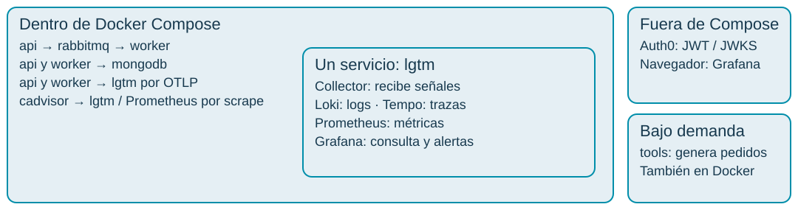

docker compose up -d --build --wait --wait-timeout 300

**Notas para explicar:**

- El borde grande delimita los servicios que levanta Compose: API, RabbitMQ, worker, MongoDB, cAdvisor y LGTM. Las flechas indican conexiones dentro de su red; usamos nombres de servicio.
- LGTM es un solo servicio de Compose que agrupa Collector, Loki, Tempo, Prometheus y Grafana. OpenTelemetry en API y worker genera señales; el Collector las recibe; Grafana consulta los backends.
- El comando construye imágenes y levanta los seis servicios. tools corre bajo demanda para generar tráfico, también en un contenedor. No necesitamos Node.js en el host.
- Auth0 es externo y requiere un token real para el alumno. El navegador abre Grafana en localhost:3007 y la API está publicada en localhost:3008. LGTM es un empaquetado para desarrollo y clase.

## 25. Primero encontrar la etapa lenta

**Contenido visible:**

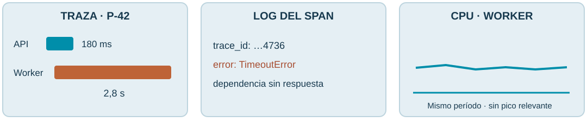

Datos ilustrativos. Hipótesis: dependencia lenta. Verificar sus tiempos antes de atribuir la causa.

**Notas para explicar:**

- El gráfico muestra tres evidencias ilustrativas: un span largo del worker, su log de timeout y una curva de CPU sin aumento relevante. Los valores son ejemplos didácticos y el trazado de barras no está a escala.
- La traza localiza la demora y el log agrega el fallo concreto. La CPU sin un pico relevante debilita una hipótesis de saturación local, pero no descarta todos los problemas de recursos.
- Para confirmar necesitamos observar la dependencia, su timeout y otras operaciones. Un TimeoutError puede ser un síntoma y no la causa raíz.

## 26. Del síntoma a una explicación comprobable

**Contenido visible:**

Síntoma El pedido tarda en completar su procesamiento. Alcance Las métricas muestran cuántas operaciones están afectadas. Localización La traza identifica la etapa donde se consume el tiempo. Detalle Los logs asociados explican el evento o error. Contraste Recursos y dependencia permiten evaluar hipótesis. Una acción correctiva debe producir una mejora observable y verificable.

**Notas para explicar:**

- Los cinco pasos relacionan señales con decisiones de investigación. No hay obligación de empezar siempre por la misma pantalla: podemos llegar desde una alerta o un pedido reportado.
- Comparar un antes y después ayuda a verificar una corrección. Conviene cambiar una variable por vez en la demostración.
- ¿Qué pasaría si esta investigación la hace un agente de IA? Necesita contexto y evidencia verificable; una correlación no autoriza por sí sola una acción automática.

## 27. Si nadie mira, el fallo pasa inadvertido

**Contenido visible:**

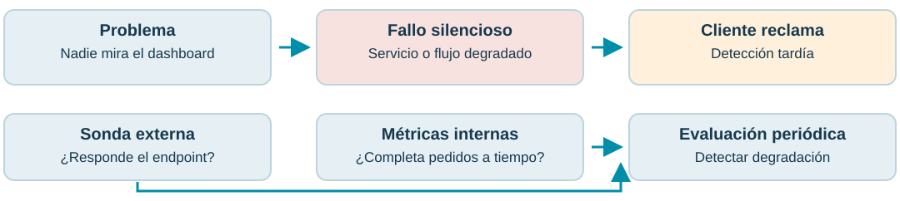

Solución: observar continuamente disponibilidad, comportamiento y resultado de negocio.

**Notas para explicar:**

- El diagrama compara detección tardía por reclamo con observación periódica. Las dos entradas de abajo, sonda externa y métricas internas, son complementarias; las flechas indican el recorrido conceptual, no que una sonda produzca métricas de negocio.
- La métrica up de Prometheus refleja si el scrape tuvo éxito, no si el flujo de pedidos completó su trabajo. Un contenedor activo tampoco basta.
- Un monitor define qué comprueba, cada cuánto y qué resultado espera. La sonda verifica el endpoint; las métricas instrumentadas verifican el flujo y su impacto. Un dashboard por sí solo no evalúa una condición ni notifica.

## 28. ¿Cómo comprobamos que el servicio funciona?

**Contenido visible:**

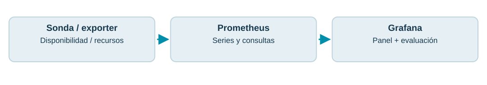

Desde afuera Blackbox Exporter: sondas HTTP, TCP y DNS. Para probar el negocio completo, una prueba sintética específica. Desde adentro OpenTelemetry: métricas del servicio. cAdvisor: recursos. RabbitMQ exporter/plugin: estado de colas.

**Notas para explicar:**

- El gráfico muestra sondas y exporters alimentando series en Prometheus y su visualización en Grafana. Las tarjetas separan observación externa e interna. Un exporter expone datos para recogerlos.
- Blackbox Exporter comprueba conectividad o respuestas configuradas; un HTTP 200 de health no prueba un flujo de negocio completo. Una prueba sintética debe comprobar un resultado esperado y evitar efectos no controlados.
- Para observar acumulación de mensajes necesitamos métricas del broker, no solo CPU. El laboratorio incluye cAdvisor y métricas de aplicación. Blackbox y las métricas del broker son opciones conceptuales; no se instalan en esta actividad.

## 29. Liveness y readiness: dos decisiones

**Contenido visible:**

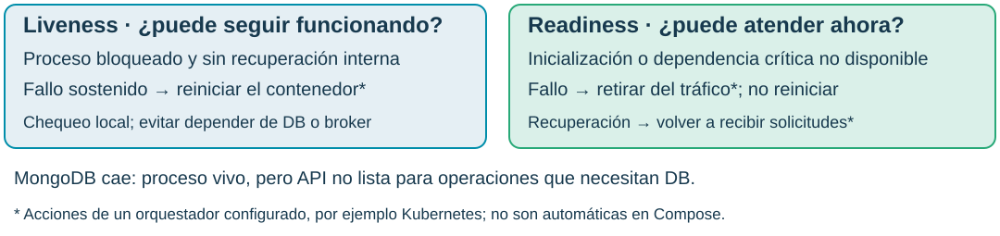

Laboratorio:  /health  solo comprueba respuesta HTTP. No prueba DB, broker ni el flujo completo; Compose no separa ambas sondas.

**Notas para explicar:**

- Las dos tarjetas distinguen decisiones: liveness pregunta si el proceso puede seguir funcionando; readiness si esta instancia puede atender ahora. Las flechas textuales muestran reinicio frente a retiro y retorno al tráfico.
- Usamos liveness para bloqueos que requieren reiniciar. Evitamos usar una caída de MongoDB o RabbitMQ como motivo de reinicio de todas las réplicas: reiniciar la API no repara una dependencia externa. Umbrales y tiempos evitan reaccionar a un fallo aislado.
- Usamos readiness durante inicialización o cuando una dependencia crítica impide atender el contrato. Si MongoDB cae, el proceso puede seguir vivo y la instancia dejar de estar lista. Elegimos las dependencias según las operaciones que debe servir; comprobar todas indiscriminadamente puede retirar toda la capacidad.
- En Kubernetes, tras los umbrales configurados, liveness reinicia el contenedor y readiness lo retira de los endpoints de los Services; cuando se recupera vuelve a entrar. Startup probe protege arranques lentos antes de habilitar esas sondas. La API de nuestro Compose tiene un healthcheck: /health responde si el servidor HTTP atiende, no verifica la conectividad actual de DB o broker. depends_on con service_healthy ordena el arranque; unhealthy por sí solo no reinicia ni retira tráfico.

## 30. Detectar no alcanza: hay que avisar y actuar

**Contenido visible:**

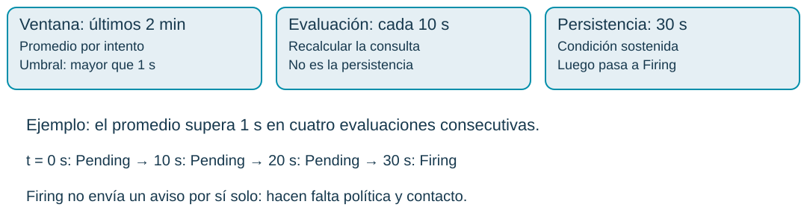

Regla del práctico:  Worker lento (promedio de intentos) . No hay notificaciones externas configuradas.

**Notas para explicar:**

- Las tres cajas separan ventana, evaluación y persistencia. Debajo, la línea temporal muestra cuatro evaluaciones consecutivas con la condición cumplida. Son parámetros de la regla real del laboratorio.
- Cada diez segundos calculamos el promedio por intento sobre los últimos dos minutos. Si supera un segundo, entra en Pending. Si la condición continúa durante treinta segundos, pasa a Firing; si deja de cumplirse antes, se reinicia la espera.
- El ejemplo supone datos disponibles y evaluaciones puntuales. La ingestión y la frecuencia de evaluación condicionan el momento observado. Los dos minutos no son el tiempo que debemos esperar para disparar.
- El laboratorio permite observar el estado. Firing no implica que alguien recibió un aviso: hacen falta política, contacto y responsable. El siguiente gráfico diferencia estados y falta de datos.

## 31. Pendiente no significa notificada

**Contenido visible:**

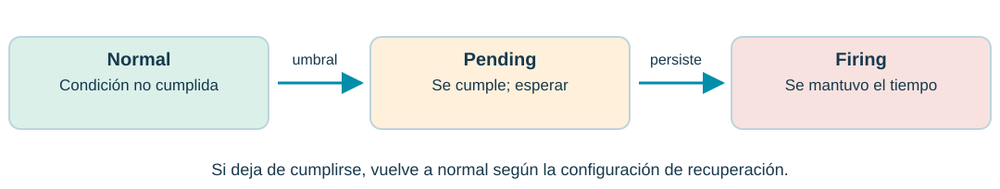

No Data:  faltan datos.  Error:  falla la evaluación. Definir su tratamiento; no asumir normalidad.

**Notas para explicar:**

- Las tres cajas ordenan normal, pending y firing. La persistencia evita que un pico breve dispare la regla; la recuperación también depende de configuración. El aviso inferior distingue pérdida de datos y error de evaluación.
- Una condición sostenida filtra picos breves. Las políticas de agrupación, silencios y puntos de contacto deciden cuándo y dónde llega una notificación.
- Sin datos podemos haber perdido recolección; si se desconecta cAdvisor no interpretamos memoria cero. Debemos configurar explícitamente el tratamiento.

## 32. Alertar por impacto; usar recursos como contexto

**Contenido visible:**

Síntoma accionable Demora sostenida, errores técnicos o pedidos que no completan su flujo. Contexto diagnóstico CPU alta, memoria cerca del límite o crecimiento de pendientes. Cada alerta debe indicar servicio, condición, período, responsable y primer paso de diagnóstico.

**Notas para explicar:**

- Las tarjetas distinguen señales de impacto y contexto para investigar. Una alerta de recursos puede ser útil si anticipa un riesgo real y tiene una acción definida.
- Más alertas no implica mejor observabilidad: el ruido hace que se ignoren. Establecemos severidad y evitamos duplicados.
- Un runbook es una guía breve de respuesta: abrir dashboard, buscar trazas y logs, verificar dependencia y escalar al responsable.

## 33. Dos rutas para evaluar y notificar

**Contenido visible:**

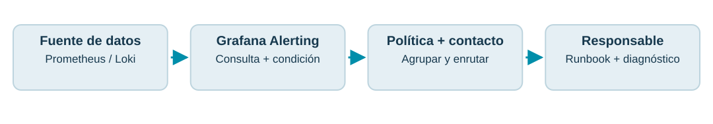

Alternativa:  reglas en Prometheus → Alertmanager → contacto. Alertmanager agrupa, silencia y enruta; no recoge métricas.

**Notas para explicar:**

- Las cajas muestran la ruta seleccionable en Grafana: datos, evaluación, política y contacto, y responsable. Debajo aparece la alternativa de Prometheus con Alertmanager.
- Grafana Alerting permite reglas y notificaciones sobre fuentes compatibles. Un contacto es el destino, como correo o webhook; la política decide qué alertas van a ese destino y cómo agruparlas.
- En la otra ruta Prometheus evalúa las reglas y Alertmanager gestiona sus notificaciones. No necesitamos ambas rutas duplicando la misma alerta. En la clase podemos mostrar el estado sin enviar comunicaciones externas.

## 34. Cuando el fallo cruza servicios y afecta al negocio

**Contenido visible:**

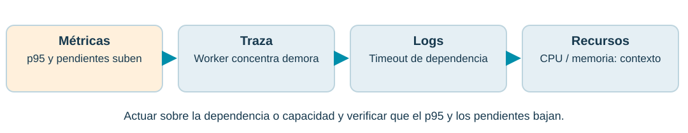

Caso:  pico de pedidos; la API responde, pero aumenta el tiempo hasta completar el procesamiento. También útil:  regresión tras un despliegue, dependencia externa intermitente y reintentos o duplicados difíciles de reconstruir.

**Notas para explicar:**

- El gráfico muestra un caso de demanda alta: las métricas detectan impacto, la traza localiza el tramo, los logs aportan el error y los recursos permiten contrastar hipótesis. No se demuestra una causa por coincidir en el tiempo.
- Una alerta abre la investigación; buscamos una traza afectada, consultamos sus logs y comparamos CPU, memoria y estado de cola en el intervalo. Si apunta a una dependencia, revisamos sus tiempos y errores.
- Después de corregir verificamos reducción del p95, recuperación del procesamiento y menos errores. La observabilidad completa es especialmente valiosa si hay varios servicios, asincronía o fallos intermitentes; su cobertura depende de instrumentación y retención.
- Los otros ejemplos usan el mismo método: comparar versiones tras un despliegue, observar llamadas externas y reconstruir intentos con identidad de negocio y contexto. No conserva automáticamente todas las trazas ni reemplaza una auditoría transaccional.

## 35. Así se construye un diagnóstico con evidencia

**Contenido visible:**

Señal Ejemplo guiado del escenario lento Traza API responde; dependencia.simulada tarda ~3 s en el worker. Logs de esa traza pedido.failed → pedido.retry → pedido.processed. Métricas del período Duración por intento aumenta; comparar CPU y memoria reales. Alerta Promedio > 1 s sostenido 30 s: Pending → Firing. Conclusión:  hay una espera y una falla transitoria configuradas. Sin medir recursos, no podemos atribuirla a saturación de CPU. Ejemplo guiado, no captura de tu ejecución. Tu entrega debe incluir capturas, IDs y período propios.

**Notas para explicar:**

- La tabla conecta una etapa lenta, tres eventos del log, métricas y una regla. Es un ejemplo guiado basado en el escenario preparado, no una captura ni evidencia del equipo del alumno.
- La dependencia simulada tarda tres segundos; el primer intento falla y se reintenta hasta procesar. Un HTTP 200 de la API no demuestra que el worker terminó. Para eso necesitamos evidencia posterior.
- Una espera no implica CPU alta. Si el alumno observa CPU baja, eso es compatible con la espera; debe mostrar CPU y memoria del período antes de afirmar qué ocurrió en su equipo.
- La evidencia individual contiene capturas propias, IDs, período, estado de la alerta y comparación con propagación desactivada. Distinguimos observación, hipótesis y comprobación; la actividad no cambia Entrega 1 del TPI.

## 36. ¿Podemos explicar qué pasó?

**Contenido visible:**

Traza ¿Dónde se demoró la operación? Logs ¿Qué registró esa etapa? Métricas ¿Cuántas operaciones afectó y cómo estaban los recursos? Correlación conecta la evidencia. Monitoreo detecta condiciones. Alertas movilizan una respuesta.

**Notas para explicar:**

- Las tres tarjetas recuperan las preguntas iniciales y el cierre relaciona señales con monitoreo y respuesta.
- Preguntar: si eliminamos los headers de contexto del mensaje, ¿qué se rompe? Esperamos perder continuidad entre productor y consumidor y navegación confiable entre sus señales.
- Preguntar: si vemos CPU alta y una traza lenta, ¿demostramos causalidad? No; necesitamos más evidencia y contraste.

## 37. Para profundizar y preparar el entorno

**Contenido visible:**

OpenTelemetry: señales OpenTelemetry: propagación de contexto Grafana: backend Docker OpenTelemetry LGTM Grafana: correlación traza–logs Prometheus: métricas de contenedores con cAdvisor Grafana: evaluación de alertas Prometheus y Alertmanager  ·  Blackbox Exporter  ·  Notificaciones en Grafana Kubernetes: liveness, readiness y startup probes Fuentes base: 04/10/2026; sondas de salud: 05/10/2026. Ejemplos y umbrales de esta presentación son didácticos.

**Notas para explicar:**

- Los enlaces apuntan a documentación oficial de conceptos, herramientas y configuración. Consultarlos para preparar la implementación.
- La documentación no demuestra que nuestro entorno funciona. El laboratorio fue validado en Docker Desktop ARM64 con una fixture RS256; la actividad del alumno usa Auth0 real.
- Finalizamos con el objetivo observable: reconstruir una operación y explicar su problema relacionando las tres señales.
