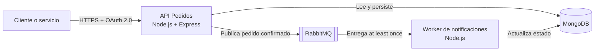

# Arquitectura — vista C4 de contenedores

## Responsabilidades

- **Cliente o servicio:** envía token e `Idempotency-Key`.
- **API Pedidos:** valida permisos, confirma el pedido y publica el evento.
- **MongoDB:** persiste pedidos, identidad y eventos procesados.
- **RabbitMQ:** desacopla productor y consumidor, retry y DLQ.
- **Worker:** consume, deduplica por `eventId` y actualiza el estado.

El diagrama muestra contenedores y relaciones. No intenta describir clases ni líneas de código.
